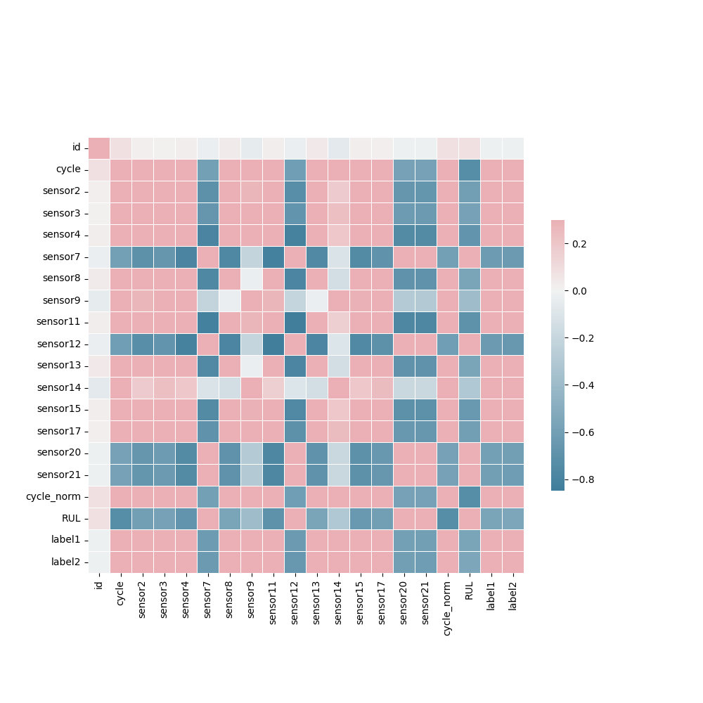
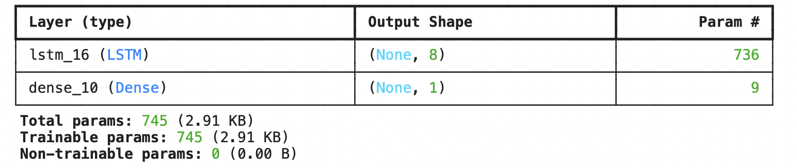
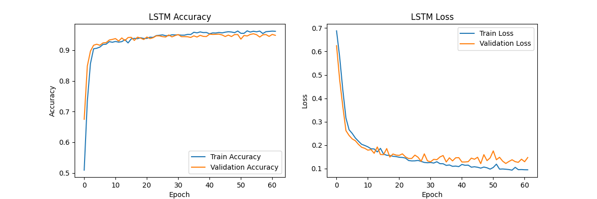
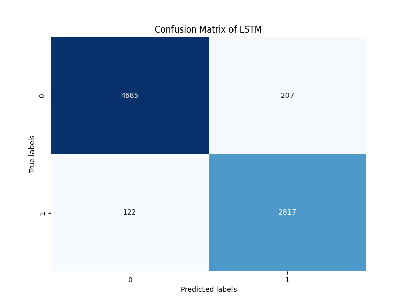
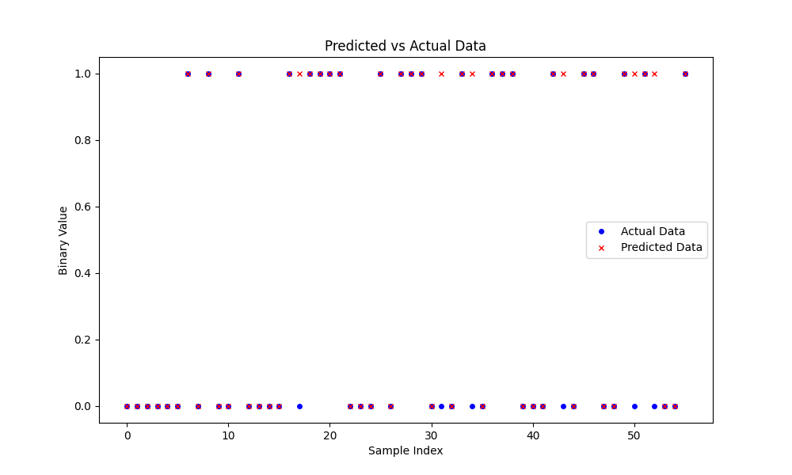
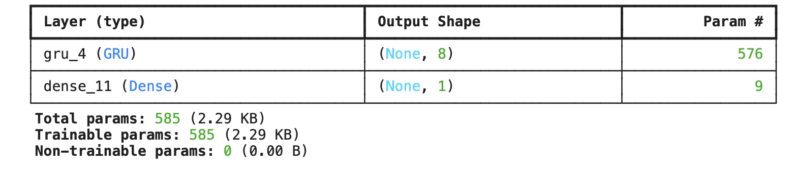
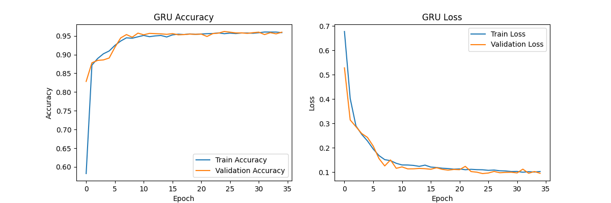
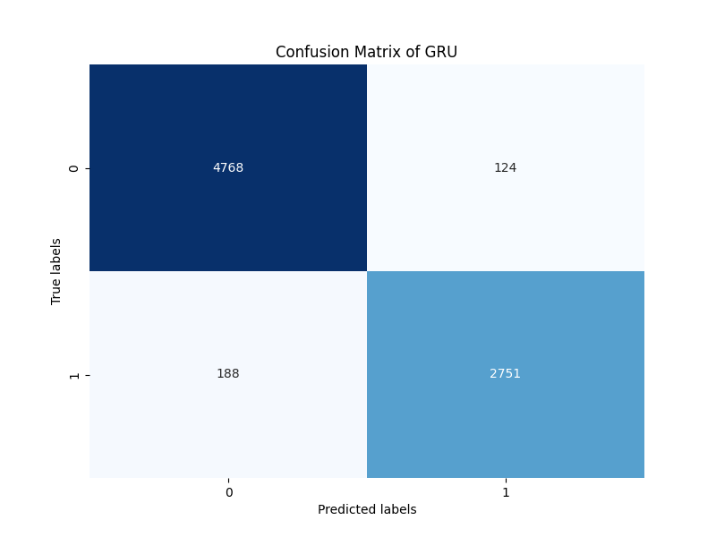
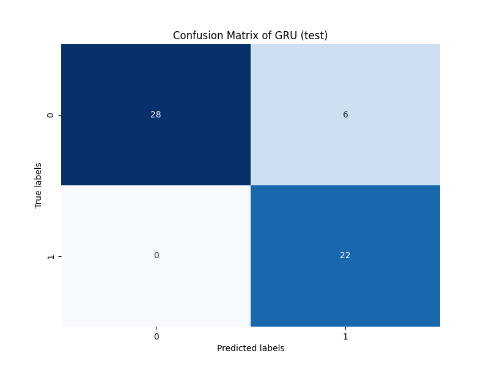

# NASA-RUL-Assignment

[CMU 95820-A1 Application of NL(X) and LLM] Assignment 1

## Dataset Structure

For this assignment, we are using the NASA Turbofan Jet Engine Data Set from [here](https://data.nasa.gov/Aerospace/CMAPSS-Jet-Engine-Simulated-Data/ff5v-kuh6/about_data). The features (columns) are shown below:

<dl>
  <dt> Index Names </dt>
  <dd> - "engine" : Engine No. </dd>
  <dd> - "cycle" : Time, In Cycles </dd>
  <dt> Setting Names </dt>
  <dd> - "setting1" : Operation Setting 1 </dd>
  <dd> - "setting2" : Operation Setting 2 </dd>
  <dd> - "setting3" : Operation Setting 3 </dd>
  <dt> Sensor Names </dt>
  <dd> - "sensor1" : Fan Inlet Temperature (◦R) </dd>
  <dd> - "sensor2" : LPC Outlet Temperature (◦R) </dd>
  <dd> - "sensor3" : HPC Outlet Temperature (◦R) </dd>
  <dd> - "sensor4" : LPT Outlet Temperature (◦R) </dd>
  <dd> - "sensor5" : Fan Inlet Pressure (psia) </dd>
  <dd> - "sensor6" : Bypass-Duct Pressure (psia) </dd>
  <dd> - "sensor7" : HPC Outlet Pressure (psia) </dd>
  <dd> - "sensor8" : Physical Fan Speed (rpm) </dd>
  <dd> - "sensor9" : Physical Core Speed (rpm) </dd>
  <dd> - "sensor10" : Engine Pressure Ratio(P50/P2) </dd>
  <dd> - "sensor11" : HPC Outlet Static Pressure (psia) </dd>
  <dd> - "sensor12" : Ratio of Fuel Flow to Ps30 (pps/psia) </dd>
  <dd> - "sensor13" : Corrected Fan Speed (rpm) </dd>
  <dd> - "sensor14" : Corrected Core Speed (rpm) </dd>
  <dd> - "sensor15" : Bypass Ratio </dd>
  <dd> - "sensor16" : Burner Fuel-Air Ratio </dd>
  <dd> - "sensor17" : Bleed Enthalpy </dd>
  <dd> - "sensor18" : Required Fan Speed </dd>
  <dd> - "sensor19" : Required Fan Conversion Speed </dd>
  <dd> - "sensor20" : High-Pressure Turbines Cool Air Flow </dd>
  <dd> - "sensor21" : Low-Pressure Turbines Cool Air Flow </dd>

## Task

In this assignment, we are asked to predict if an engine's Remaining Useful Life (RUL) will fall within a certain number of cycles. Essentially, it is a binary classification task where 1 indicates the RUL of an engine is smaller than and equal to 30, and 0 indicates the RUL of an engine is larger than 30. With this in mind, we are using LSTM and GRU as our primary models to predict the output. Eventually, we will compare the performance of these two models and discuss the results.

## Usage

Before running the code, I recommend upload the files into Google Colab for better compatibility. In addition, make sure to install `torchinfo` using the following command:

```
pip install torchinfo
```

Next, to download the data directly from Kaggle, one can follow the following command:

```
pip install --upgrade --force-reinstall --no-deps kaggle==1.5.8
mkdir /root/.kaggle
python code/get_data.py --kaggle_path <Path to kaggle.json> --username <Your Kaggle username> --key <Your Kaggle key>
chmod 600 /root/.kaggle/kaggle.json
kaggle datasets download behrad3d/nasa-cmaps
mkdir train
unzip nasa-cmaps.zip -d train
```

Now that the data is prepared, one can head to `code/config.json` and modify the configuration such as paths to the data, batch size, etc.

After modifying the necessary configuration, one can run the following commands which will execute every part of this assignment:

```
cd code
python main_rul.py
```

Note that one can change the models' names and figures' names inside `code/main_rul.py`.

If one would like to use the trained models that I used, he/she can find the `.keras` files in the `checkpoints` folder.

## Repository Content

For the main code, one can find it in the `code` folder. The code is in `.py` format where all the processes are done in a single file.

For the visualizations of different plots, one can find it in the `visualization` folder. Note that I have saved the plots for my training of LSTM and GRU in different subfolders for better categorization. However, if one runs the code directly, all the figures will be save under `visualizations` folder. One can always change the saveing paths in `code/config.json` file. In addition, the predicted results of both LSTM and GRU can be found in the `predictions` folder where all the `.csv` files are stored.

The report for this assignment is created as `report_rul.pdf` in the main directory. Finally, the references are shown below. For the detail interaction with ChatGPT, one can find them in `Appendix.pdf`.

## References

- OpenAI. (2024). ChatGPT [Large language model]. Details can be found in [Appendix.pdf](Appendix.pdf).
- Kaggle, NASA Turbofan Jet Engine Data Set ([link](https://www.kaggle.com/datasets/behrad3d/nasa-cmaps)).

<!-- ## Feature Selection

By printing out the dataframe, I first noticed that columns 26, 27 are all NaN values. Therefore, I first drop these two columns. In addtion, settings 1, settings2, settings 3, sensor 1, sensor 10, sensor 18 and sensor 19 have almost zero standard deviation, which indicates that they carry low information for model learning. I will drop these features as well. Finally, I will drop sensor 5, sensor 6, sensor 16 which have identical mean, minimum, and maximum values, indicating no variability.

By following the starter-notebook, we can then construct our final training and testing dataframe. Below is the correlation matrix of the training dataframe.


As we can see, after dropping rebundant columns, most remaining features have fairly good correlation with each other.

## Training

For fair comparison, I used the same training hyper-parameters for both LSTM and GRU. The details are listed below.

- Epochs = 100
- Batch size = 64
- Early Stopping:
  - patience = 10
  - min_delta = 0.00001

## Precision, Recall and F1 score

Before diving into the performances of LSTM and GRU, I would like to introduce the metrics used to measure the model performancs. In addition to accuracy, precision and recall scores are also used:

- Precision = $\frac{True Positive}{True Positive+False Positive}$
- Recall = $\frac{True Positive}{True Positive+False Negative}$
- F1 Score = $2\times\frac{Precision \times Recall}{Precision+Recall}$

As we can see above, precision score accounts for the fail cases where the model incorrectly classify instances as positive. On the other hand, recall score accounts for the fail cases where the model cannot identify positive cases. Finally, F1 score is simply the harmonic mean of precision and recall.

## LSTM

After finishing data pre-processing, we can start training both the LSTM and GRU. In this section, I will show the results of LSTM. To limit the model parameters under 10,000, I use only two layers of LSTM with sequence length equals to 128. The total parameters count is 8,289 as shown below:


Here is the training and validation loss/accuracy of LSTM.


From the loss curves, we can see that LSTM slightly overfit the training dataset with the validation loss exceeding the training loss. In addition, we can also plot the confusion matrix of LSTM on training set (top) and testing set (bottom).



As we can see, LSTM achieved a fairly good performance on predicting the Remaining Useful Life of each engine. In summary, below are the performances of LSTM on every metrics:

- Training Accuracy = 0.958
- Training Precision = 0.932
- Training Recall = 0.958
- Testing Accuracy = 0.893
- Testing Precision = 0.786
- Testing Recall = 1.0
- Testing F1 Score = 0.88

Finally, we can visualize the data points of predicted sample and true labels.


## GRU

Similarly, we can do the same analysis on GRU. The GRU model consists of two layers with Dropout layers as shown below:


The training and validation loss/accuracy curves, confusion matrices are shown in figures below:






As we can see, GRU has less false positive but more false negative cases compared to LSTM on the training set. However, both of them have similar performances on the testing set. The metrics performances of GRU are listed below:

- Training Accuracy = 0.960
- Training Precision = 0.957
- Training Recall = 0.936
- Testing Accuracy = 0.893
- Testing Precision = 0.786
- Testing Recall = 1.0
- Testing F1 Score = 0.88

## LSTM V.S. GRU

In this section, we will discuss more details about the comparison between LSTM and GRU.

| Metrics\Models     | LSTM      | GRU       |
| ------------------ | --------- | --------- |
| Training Accuracy  | 0.958     | **0.960** |
| Training Precision | 0.932     | **0.957** |
| Training Recall    | **0.958** | 0.936     |
| Testing Accuracy   | 0.893     | 0.893     |
| Testing Precision  | 0.786     | 0.786     |
| Testing Recall     | 1.0       | 1.0       |
| Testing F1 Score   | 0.88      | 0.88      |

Although LSTM has a slightly higher recall on the training set, GRU shows marginally better performance in accuracy and precision with fewer trainable parameters. This suggests that GRU might be a more efficient model for learning certain patterns in the training data.

However, when evaluated on the testing set, both models demonstrate the exact same performance across all metrics, including accuracy, precision, recall, and F1 score. This identical performance suggests that both LSTM and GRU generalize equally well to unseen data for this particular task, despite the differences in their training results.

Interestingly, both models achieved a perfect recall score (1.0) on the testing set. This indicates that neither model produced any false negatives, meaning they successfully identified all positive instances in the testing set. However, this might also suggest potential overfitting since perfect recall might not always align with optimal generalization. Given that precision is relatively lower (0.786), the models might be over-predicting the positive class, which could lead to a trade-off between precision and recall.

In conclusion, while GRU appears to be more efficient during training with slightly better precision and accuracy, both models perform identically in testing, implying that the choice between LSTM and GRU might depend on computational efficiency and the specific dataset in use. Further investigation into precision-recall trade-offs and the evaluation of additional metrics like the confusion matrix may help in making a final decision on model selection. -->
